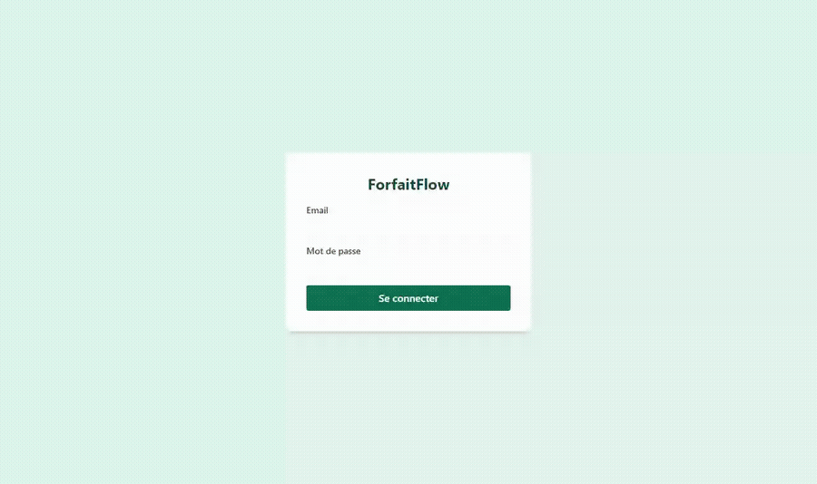
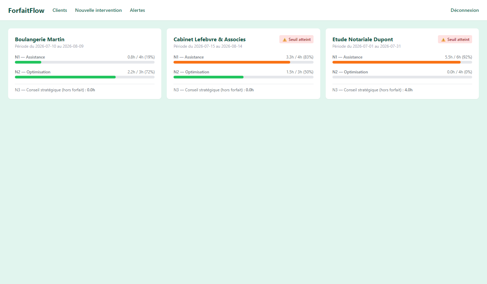
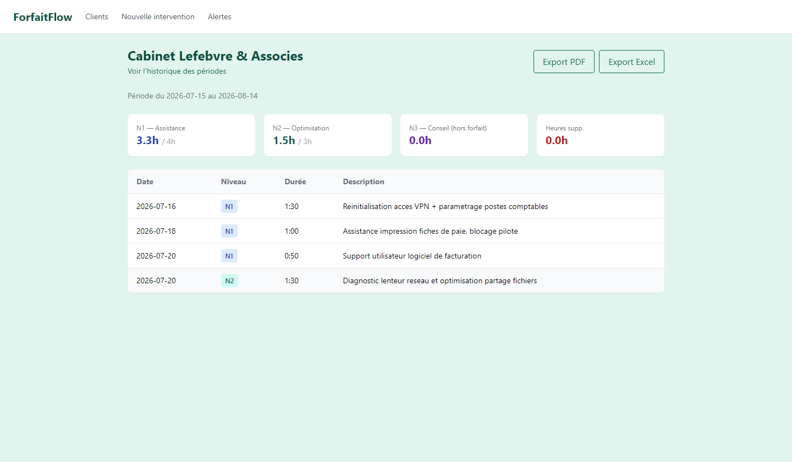
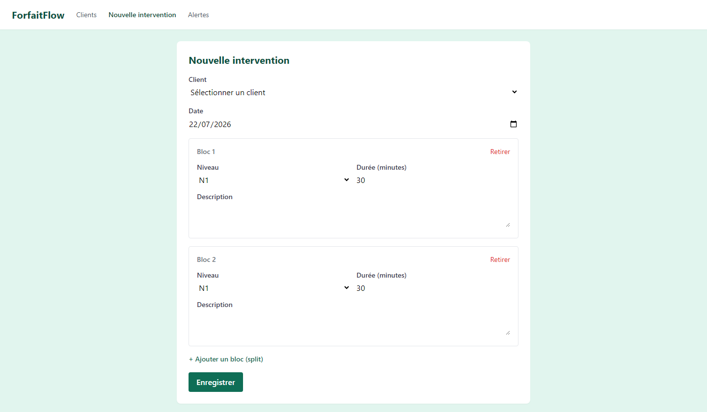
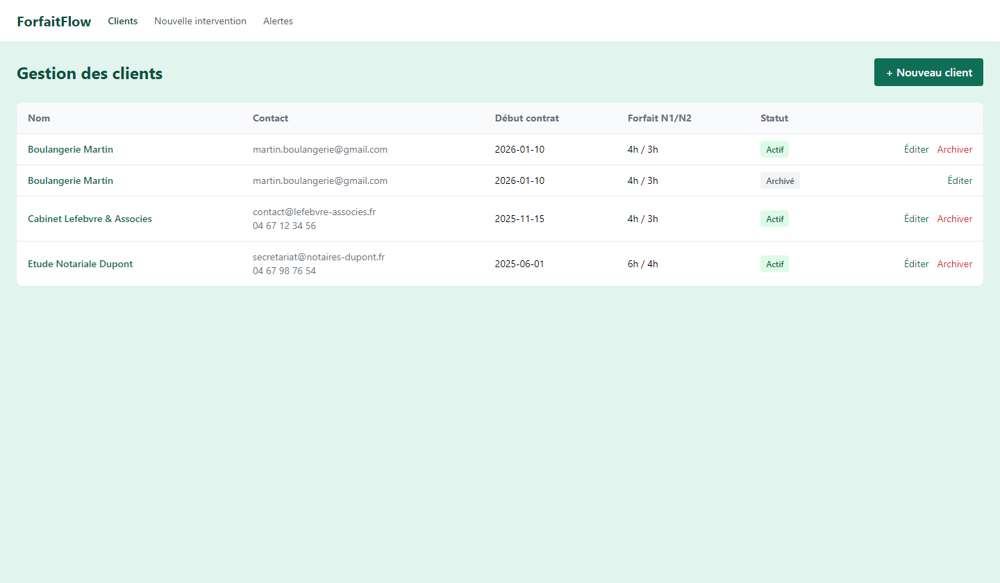
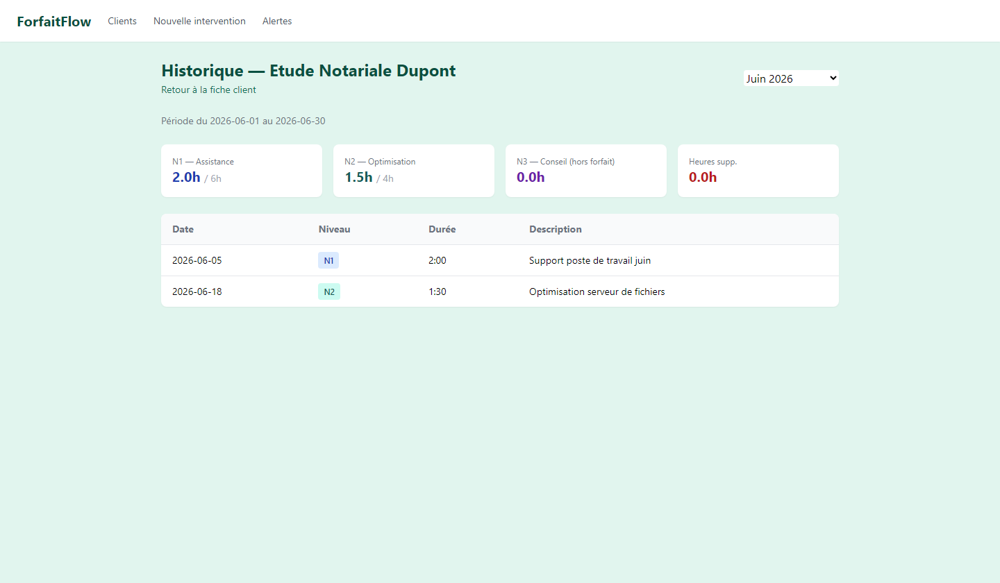
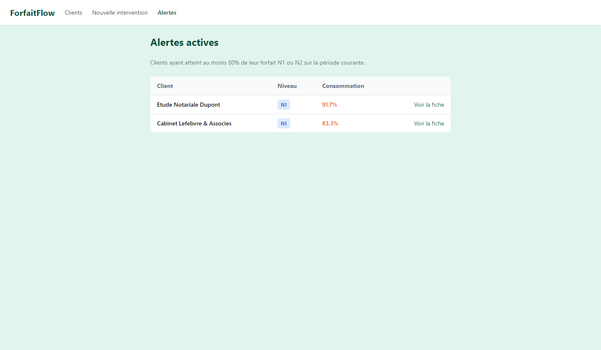

<div align="center">

# 🕒 ForfaitFlow

**Suivi d'interventions au forfait mensuel, par niveau d'expertise.**

Pour consultants et coachs numériques qui gèrent plusieurs clients au temps passé.

[](https://opensource.org/licenses/MIT)
[]()
[]()

</div>

---

## ✨ Pourquoi ForfaitFlow

Vous vendez à vos clients un forfait mensuel d'heures d'assistance et d'expertise. Vous voulez :

- ✅ **Suivre** combien d'heures vous consommez sur chaque forfait, en temps réel
- ✅ **Être alerté** quand vous approchez du plafond mensuel (80%)
- ✅ **Justifier** chaque intervention par une description horodatée
- ✅ **Exporter** un rapport mensuel PDF ou Excel à envoyer au client
- ✅ **Distinguer** trois niveaux d'intervention (support, optimisation, conseil stratégique)

ForfaitFlow fait exactement ça — et rien d'autre.

Ce n'est **pas** un outil de facturation. La facturation reste gérée par votre logiciel comptable habituel.

---

## 🎯 Cas d'usage type

> *« Mon client cabinet comptable a souscrit un forfait de 4h de support et 3h d'optimisation par mois. Je veux savoir en un coup d'œil où on en est, et prouver le détail des interventions s'il le demande. »*

Chaque client dispose de :
- **4h/mois** de Niveau 1 — assistance et prise en main
- **3h/mois** de Niveau 2 — optimisation et diagnostic
- **Niveau 3** hors forfait — conseil stratégique sur devis

Chaque intervention est saisie manuellement avec sa durée et sa description. Le compteur se remet à zéro à la date anniversaire du contrat (pas au 1er du mois calendaire).

---

## 🖼️ Aperçu



| Tableau de bord | Fiche client |
|---|---|
|  |  |
| Vue liste des clients avec jauges N1/N2 et badges d'alerte à 80% | Stat cards + tableau détaillé des interventions + export PDF/Excel |

| Nouvelle intervention (split) | Gestion des clients |
|---|---|
|  |  |
| Blocs empilables pour splitter une session sur plusieurs niveaux | CRUD clients, forfaits personnalisés, archivage |

| Historique | Alertes globales |
|---|---|
|  |  |
| Consultation des périodes passées, mois par mois | Vue transverse de tous les clients en alerte |

---

## 🏗️ Stack technique

| Couche | Technologie |
|--------|-------------|
| Frontend | Vue 3 (Composition API) + Vite + Tailwind CSS v3 + Pinia |
| Backend | Python 3.11 + FastAPI + SQLAlchemy 2.0 + Alembic |
| Base de données | PostgreSQL 16 |
| Auth | JWT + bcrypt |
| Export PDF | WeasyPrint |
| Export Excel | openpyxl |
| Conteneurisation | Docker Compose |
| PWA | manifest + service worker (installable mobile) |

---

## 🚀 Installation (dev)

**Prérequis** : Docker + Docker Compose

```bash
git clone https://github.com/tavenamicka/forfaitflow.git
cd forfaitflow
cp .env.example .env
# Éditez .env pour renseigner JWT_SECRET, DB_PASSWORD, ADMIN_EMAIL, ADMIN_PASSWORD

docker compose up -d --build
docker compose exec backend alembic upgrade head
```

L'application est disponible sur :
- Frontend : http://localhost:8092
- API : http://localhost:8093/docs (Swagger)

---

## 🌐 Déploiement (self-hosted)

ForfaitFlow est conçu pour être auto-hébergé (RGPD-friendly). Le `docker-compose.yml` fourni est directement utilisable en production (sidecar `pg_dump` quotidien inclus), avec un exemple de configuration Nginx en reverse proxy et Let's Encrypt.

Voir [`docs/DEPLOY.md`](docs/DEPLOY.md).

---

## 📋 Fonctionnalités V1

- [x] Gestion multi-clients avec forfaits personnalisés
- [x] Saisie d'interventions avec split par niveau
- [x] Description obligatoire pour justification
- [x] Calcul automatique de la période courante (date anniversaire par client)
- [x] Alerte visuelle au seuil de 80% du forfait
- [x] Comptabilisation des heures supplémentaires (au-delà du forfait)
- [x] Export PDF et Excel
- [x] Historique des périodes passées
- [x] Vue transverse des alertes actives
- [x] PWA installable sur mobile

## 🔮 Roadmap V2

- [ ] Portail client (accès read-only à son propre dashboard)
- [ ] Multi-consultant (partage d'équipe)
- [ ] Notifications email au seuil d'alerte
- [ ] Import d'historique depuis Excel/CSV
- [ ] Registre RGPD intégré
- [ ] API publique read-only pour intégration comptable

---

## 📜 Licence

Distribué sous licence **MIT**. Voir [`LICENSE`](LICENSE) pour le texte complet.

---

## 👤 Auteur

**Mickaël Tavenart** — administrateur réseau et systèmes, consultant Coatch-numérique
Développeur full‑stack et créateur d’applications assistées par IA

- GitHub : [@tavenamicka](https://github.com/tavenamicka)

---

<div align="center">

*Développé en France, hébergé chez soi.* 🇫🇷

</div>
